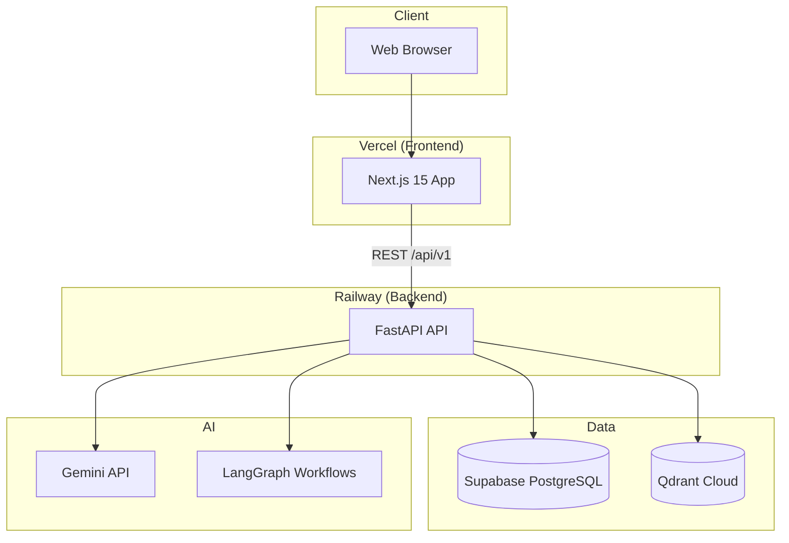
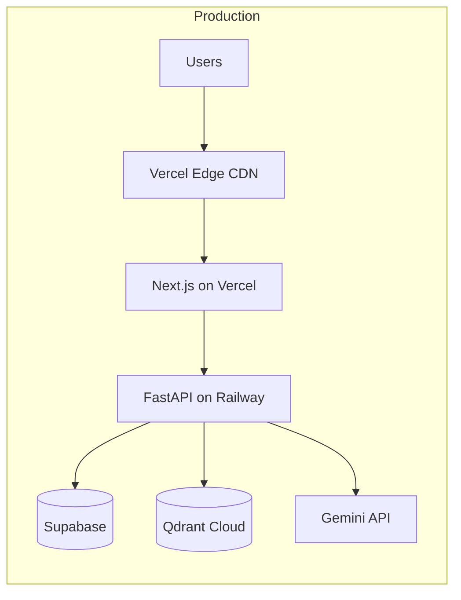

# ContractFlo Architecture

ContractFlo is an AI-native contract intelligence and contract operations platform. This document describes the system architecture at Phase 0 — the foundation upon which all subsequent phases are built.

## System Overview

ContractFlo follows a **modular monolith backend** and **decoupled SPA frontend** pattern within a single monorepo. The frontend communicates with the backend over HTTPS via a versioned REST API. External managed services handle persistence, vector search, and AI inference.

## Major Modules

### Frontend (`frontend/`)

| Module | Responsibility |
|--------|----------------|
| `app/` | Next.js App Router pages, layouts, and route groups |
| `components/ui/` | shadcn/ui primitives and design system components |
| `components/layout/` | Shell, navigation, and shared layout components |
| `hooks/` | Reusable React hooks |
| `lib/` | Utilities, constants, and API client helpers |
| `types/` | Shared TypeScript type definitions |

The frontend is a server-rendered React application optimized for Vercel deployment. It consumes the backend REST API and renders contract intelligence workflows for end users.

### Backend (`backend/`)

| Module | Responsibility |
|--------|----------------|
| `app/api/` | HTTP route definitions, versioned routers (`v1/`) |
| `app/core/` | Configuration, logging, middleware, shared infrastructure |
| `app/models/` | Domain entities and ORM models |
| `app/schemas/` | Pydantic request/response validation schemas |
| `app/services/` | Business logic and orchestration |
| `app/repositories/` | Data access — PostgreSQL, Qdrant, external APIs |

The backend is a FastAPI application structured for clear separation of concerns. Routes are thin; services contain logic; repositories handle I/O.

### Documentation (`docs/`)

Architecture decisions, roadmap, and development standards live alongside the codebase for discoverability and onboarding.

### Scripts (`scripts/`)

Cross-cutting developer automation — environment setup, local orchestration, and CI helpers.

## Technology Stack

| Layer | Technology | Purpose |
|-------|------------|---------|
| Frontend framework | Next.js 15 | SSR, routing, React Server Components |
| Frontend language | TypeScript | Type-safe UI development |
| Styling | Tailwind CSS v4 | Utility-first CSS |
| UI components | shadcn/ui | Accessible, composable component library |
| Backend framework | FastAPI | High-performance async Python API |
| Backend language | Python 3.12 | Modern Python with strong typing |
| Primary database | Supabase PostgreSQL | Relational data, auth (future), RLS |
| Vector database | Qdrant Cloud | Contract embeddings and semantic search |
| LLM | Gemini API | Contract analysis, extraction, Q&A |
| Agent orchestration | LangGraph | Multi-step AI workflows |
| Frontend hosting | Vercel | Edge-optimized Next.js deployment |
| Backend hosting | Railway | Containerized FastAPI deployment |

## Deployment Architecture

### Frontend (Vercel)

- Deployed from `frontend/` directory
- Environment variables: `NEXT_PUBLIC_API_BASE_URL`
- Automatic preview deployments on pull requests
- Production domain with HTTPS and CDN caching

### Backend (Railway)

- Deployed as a Docker container from `backend/`
- Environment variables: database URLs, API keys, CORS origins
- Health check endpoint: `GET /api/v1/health`
- Horizontal scaling via Railway service replicas (future)

### External Services

- **Supabase PostgreSQL**: Managed Postgres with connection pooling; migrations managed in later phases
- **Qdrant Cloud**: Managed vector store for contract clause embeddings
- **Gemini API**: Google AI for LLM inference; accessed server-side only

## Cross-Cutting Concerns

| Concern | Approach |
|---------|----------|
| Configuration | Environment variables via `.env` (local) and platform secrets (production) |
| API versioning | URL prefix `/api/v1` |
| CORS | Configured in FastAPI middleware; restricted to known frontend origins |
| Logging | Structured stdout logging (Railway log aggregation) |
| Testing | pytest (backend), ESLint (frontend); CI on every PR |
| Security | API keys server-side only; no secrets in frontend bundle (Phase 1+) |

## Phase 0 Scope

Phase 0 establishes the repository structure, tooling, health endpoints, and documentation. No authentication, business logic, or AI features are implemented yet. Subsequent phases incrementally add capabilities following the roadmap in [roadmap.md](./roadmap.md).
